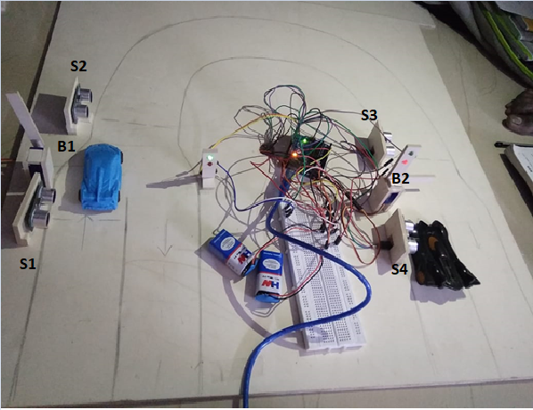

# Accident Prevention
<h2>Components used:</h2>
<ul>
	<li>Arduino Uno R3</li>
	<li>Distance ultrasonic sensor SR04</li>
	<li>Servo motor</li>
	<li>LED's</li>
</ul>
In this project we present accident prevention traffic signal system project on hairpin bend roads. Hairpin bend is an sharp U turn which are present on ghats. In areas like ghat and mountains where roads are at high height, where road conditions are not good. In some parts roads are at that narrow where it is not possible to go for 2 lanes road specially in hairpin bend, which it increases the chances of accidents, in this case this project is very useful.   
<b>Different conditions in hairpin bend road:</b> 
<b>When vehicle passes from S1 sensor:</b> 
1) If vehicle is passes from sensor s1 program will increment s1 counter. In that will set the timer of specific time and barrier B2 will close and signals R1,G2 
will turn off and R2,G1 will turn on. 

 
				Fig.1 vehicle pass through s1 sensor
 

2) After S1 that vehicles will cross to sensor s2 program will increment s2 counter according to number of vehicles.

 
				Fig.2 vehicle pass from s2 sensor

3) After S1 and S2, that vehicle will pass through sensor s3 program will increment s3 counter. After finishing the timer it will check that all the vehicles are pass or not to sensor S1,S2 and S3 by checking the sensors counter values and if counter values are not same then till the timer will again increment and let all the vehicles should be pass to all 3 sensors.

 
				Fig.3 vehicle pass from s3 sensor

<b>When vehicle passes from S4 sensor:</b> 
4)  If vehicle is passes from sensor S4 then S4 counter will increment. In that will set the timer of specific time and barrier B1 will close and signals R2,G1 will turn off and R1,G2 will turn on.

 
					Fig.4 vehicle pass from s4 sensor

5) After S4, that vehicles will cross to sensor s3 program will increment s3 counter according to number of vehicles.

 
					Fig.5 vehicle pass from s2 sensor

6) After s4 and s3 that vehicle will pass through sensor s2 program will increment s2 counter. After finishing the timer it will check that all the vehicles are pass or not to sensor S4,S3 and S2 by checking the sensors counter values and if counter values are not same then till the timer will again increment and let all the vehicles should be pass to all 3 sensors.

 
				Fig.6 vehicle pass from s2 sensor

